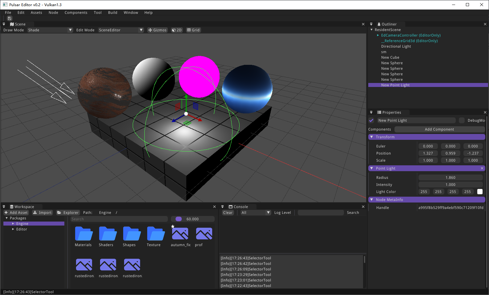
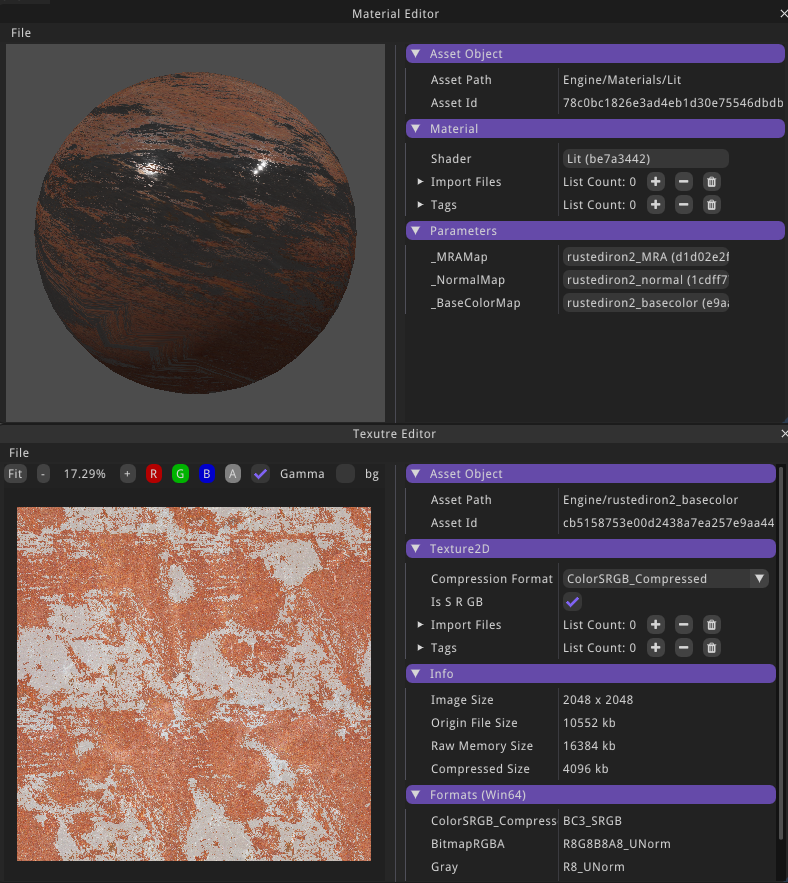

# Pulsar Engine

## 编译环境
- FBXSDK
- VulkanSDK
- 最新版VS与MSVC（C++23）
- CMAKE

## thirdparty

Engine:
- vulkan
- SDL2
- openAL
- dear-imgui (docking)
- box2d
- jolt
- stbimage
- DirectXTex
- astc-encoder

Editor:
- glslang
- spirv-cross
- fbxsdk
- assimp

